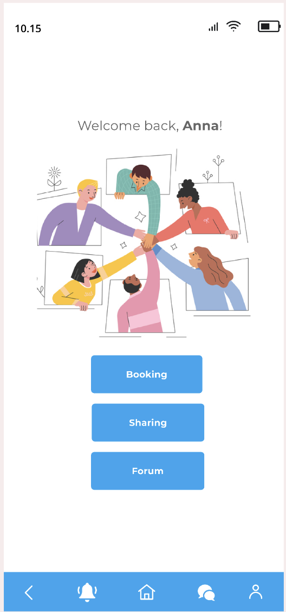
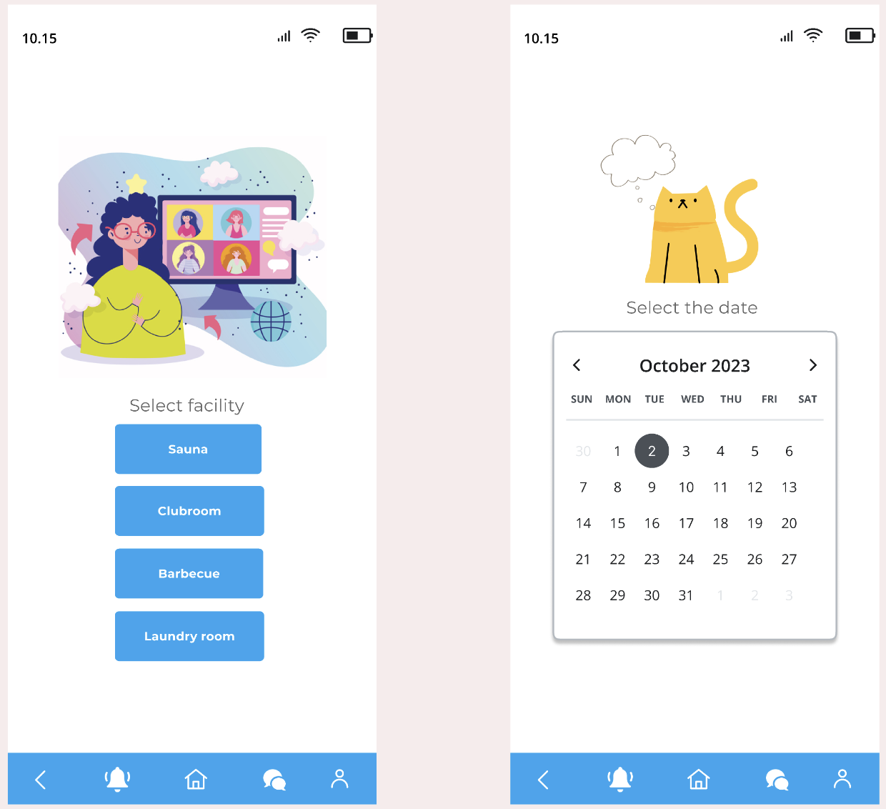

# Housy - Digital Sustainable Sharing Solution

  

## Background

Housy is a Digital Sustainable Sharing Solution for Housing Companies, designed to streamline day-to-day operations and enhance community engagement. Our primary focus is to provide residents with a user-friendly platform to manage shared resources efficiently.

## Key Features

- **Common Area Booking System:** Residents can easily book shared areas such as sauna, laundry room, barbeque, and clubroom through the mobile application. They receive notifications 24 hours before their reservation.
  
- **Resource Sharing:** Residents can share resources, including tools, appliances, and entertainment items. This feature promotes sustainability by reducing unnecessary purchases and facilitating coordination between residents.

- **Forum / Community Hub:** The community hub includes a forum where residents can share information, view upcoming events, and sign up for events within the app. Event participants receive reminders 24 hours before the event.

- **Profile Screen:** Users can view and modify their information through the profile screen.

  

## Prototype Objectives

Our prototype aims to provide intuitive navigation, painless booking processes, improved community engagement, and a pleasant user experience. Additionally, we aim to establish a channel for official communication between residents and administration.

## Design Concept

We started by brainstorming ideas and selecting the concept of "every feature/booking accessible within a few clicks". This simplicity principle guided our design process.

### Low-fidelity Prototype

We used Figma to create a minimalistic design with a blue theme, focusing on ease of access and instant user feedback. Our low-fidelity prototype emphasizes the overall flow of the application.

### High-fidelity Prototype

In the high-fidelity phase, we aimed to enhance user interactions and visual appeal based on feedback from users and our teacher. We incorporated licensed graphics and sourced images to create a simple and clear appearance for easy navigation.

[View High-fidelity Prototype](https://www.figma.com/file/2Fc96r5YEYxP75fyjQx5FA/Actual-high-fidelity-protoype?type=design&node-id=791%3A3809&mode=design&t=D7dGj3pwVh0q5jmZ-1)

## Feedback and Iterations

We received feedback from users and made iterative refinements to improve functionality and user experience. Updates include the addition of a navigation bar, enabling user posts, and enhancing clarity and functionality of icons and texts.

## Contributors

- Anh Tran
- Jibika Koirala 
- Michal Wiselka 

For further details, please refer to the complete prototypes linked above.

---
*This project was developed using Figma.*
